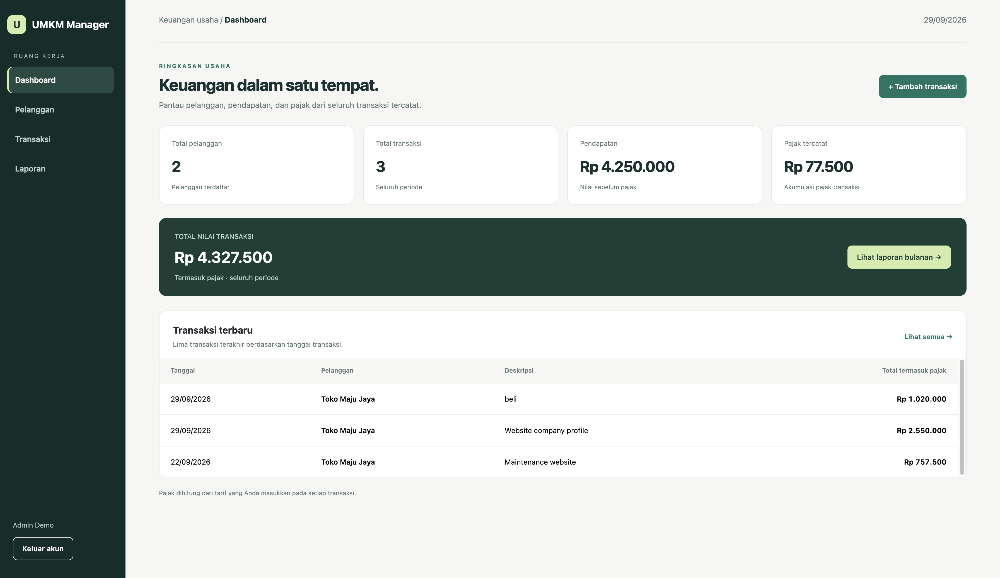
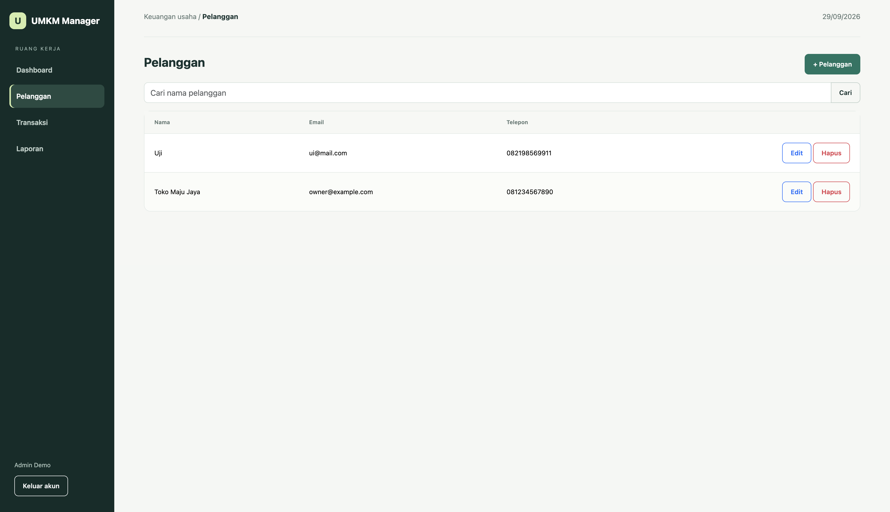
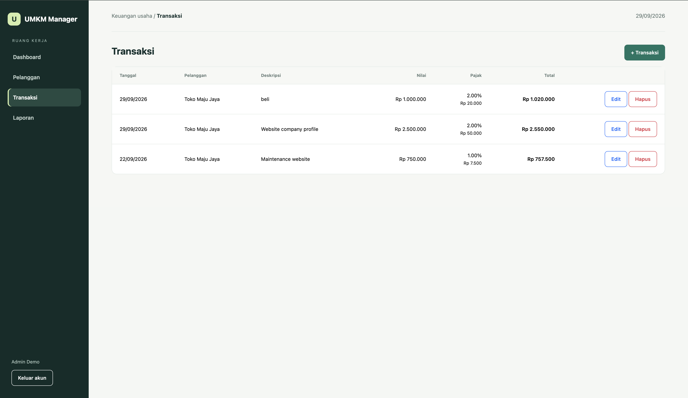
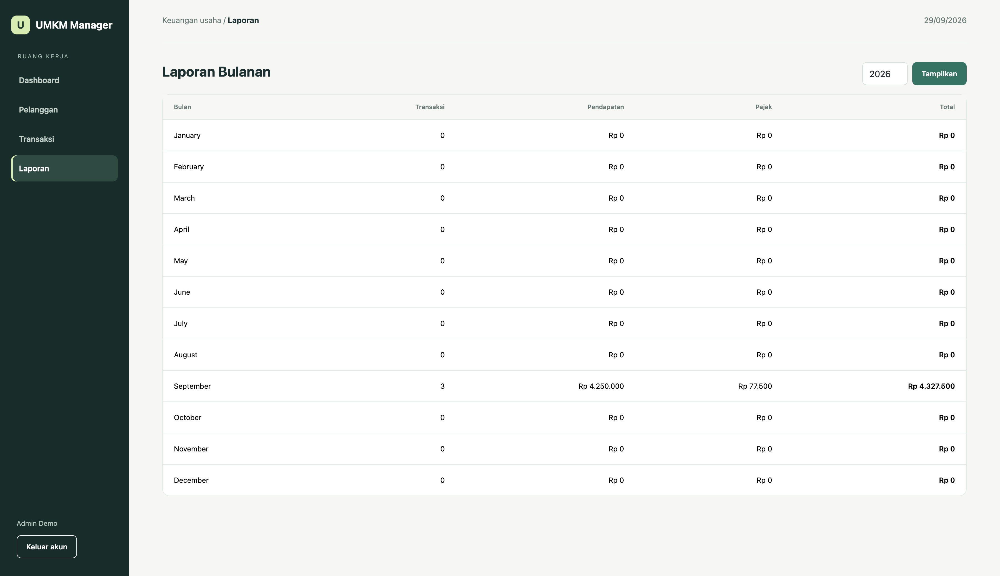

# UMKM Manager

Aplikasi web untuk mencatat pelanggan, transaksi, pendapatan, dan pajak usaha dalam satu tempat. Dibangun dengan Laravel, dengan antarmuka berbahasa Indonesia dan format mata uang Rupiah.

Proyek ini merupakan portofolio pengembangan aplikasi keuangan sederhana untuk UMKM.

## Tampilan aplikasi

### Dashboard

Ringkasan pelanggan, transaksi, pendapatan, dan pajak, lengkap dengan daftar transaksi terbaru.



<details>
<summary><strong>Pelanggan — lihat screenshot</strong></summary>

Pencarian dan pengelolaan data pelanggan.



</details>

<details>
<summary><strong>Transaksi — lihat screenshot</strong></summary>

Daftar transaksi dengan rincian nominal, tarif pajak, dan total.



</details>

<details>
<summary><strong>Laporan bulanan — lihat screenshot</strong></summary>

Ringkasan pendapatan dan pajak per bulan berdasarkan tahun yang dipilih.



</details>

## Fitur

- **Dashboard usaha:** jumlah pelanggan dan transaksi, total pendapatan sebelum pajak, akumulasi pajak, serta total nilai transaksi.
- **Manajemen pelanggan:** tambah, ubah, hapus, dan cari pelanggan berdasarkan nama.
- **Pencatatan transaksi:** pilih pelanggan, tanggal, deskripsi, nilai transaksi, dan tarif pajak.
- **Perhitungan otomatis:** nilai pajak dan total transaksi dihitung dari nominal serta tarif yang dimasukkan.
- **Filter transaksi:** telusuri transaksi menurut bulan dan tahun.
- **Laporan bulanan:** ringkasan jumlah transaksi, pendapatan, pajak, dan total per bulan untuk tahun yang dipilih.
- **Login dan logout:** halaman pengelolaan dilindungi autentikasi.
- **Tampilan responsif:** navigasi, kartu ringkasan, dan tabel menyesuaikan ukuran layar.

## Alur penggunaan

1. Masuk menggunakan akun demo pada instalasi lokal.
2. Tambahkan data pelanggan.
3. Catat transaksi dan tarif pajaknya.
4. Pantau ringkasan di dashboard.
5. Buka laporan dan pilih tahun yang ingin dilihat.

## Teknologi

| Bagian | Teknologi |
| --- | --- |
| Backend | PHP 8.3+ dan Laravel 13 |
| Antarmuka | Blade, Bootstrap 5.3, dan CSS khusus |
| Database bawaan | SQLite |
| Autentikasi | Session Laravel |
| Aset frontend bawaan | Vite 8 dan Tailwind CSS 4 |

Halaman pengelolaan memakai Bootstrap dari CDN sehingga memerlukan koneksi internet untuk memuat stylesheet tersebut.

## Menjalankan secara lokal

### Kebutuhan

- Git
- PHP 8.3 atau lebih baru, beserta ekstensi yang diperlukan Composer dan SQLite
- Composer 2

### Instalasi

Jalankan perintah berikut di Terminal:

```bash
git clone https://github.com/sukmanlife/umkm-finance-tax-manager.git
cd umkm-finance-tax-manager

composer install
cp .env.example .env
php artisan key:generate
php -r "file_exists('database/database.sqlite') || touch('database/database.sqlite');"
php artisan migrate --seed
php artisan serve
```

Buka alamat yang ditampilkan oleh server, biasanya **http://127.0.0.1:8000**.

File contoh konfigurasi memakai `DB_CONNECTION=sqlite`. Database dibuat di `database/database.sqlite`.

### Akun demo

| Kolom | Nilai |
| --- | --- |
| Email | `admin@example.com` |
| Password | `password` |

Akun dan data contoh dibuat oleh `DatabaseSeeder`. Gunakan akun ini hanya untuk demo lokal. Sebelum aplikasi dipakai secara publik, ganti kredensial demo dan sesuaikan konfigurasi produksi.

Seeder juga menambahkan pelanggan contoh dan dua transaksi. Jalankan seeder pada database baru; menjalankannya berulang dapat menambah data contoh lagi.

### Pengembangan aset frontend (opsional)

Halaman pengelolaan saat ini memakai Bootstrap CDN dan CSS pada layout Blade. Jika mengembangkan aset Vite bawaan, siapkan Node.js yang kompatibel dengan Vite 8, lalu jalankan:

```bash
npm install
npm run dev
```

Untuk membuat aset build:

```bash
npm run build
```

## Struktur utama

```text
app/Http/Controllers/   Logika dashboard, pelanggan, transaksi, laporan, dan login
app/Models/            Model pengguna, pelanggan, dan transaksi
database/migrations/   Struktur tabel database
database/seeders/      Akun dan data demo
resources/views/       Tampilan Blade
routes/web.php         Rute aplikasi
```

## Ruang lingkup

Pajak dihitung berdasarkan tarif yang dimasukkan pengguna pada setiap transaksi. Fitur ini belum mencakup penentuan tarif berdasarkan aturan perpajakan atau pelaporan pajak resmi.

Versi saat ini berfokus pada satu ruang kerja bersama. Pemisahan data antarusaha, pengaturan peran pengguna, ekspor laporan, dan pembayaran langganan belum tersedia.

## Kontribusi dan diskusi

Punya ide atau menemukan masalah? Buat [issue](https://github.com/sukmanlife/umkm-finance-tax-manager/issues) dengan penjelasan dan langkah reproduksi. Hindari menyertakan data pelanggan, kredensial, atau isi file `.env`.

Dikembangkan oleh [Sukman](https://github.com/sukmanlife).
